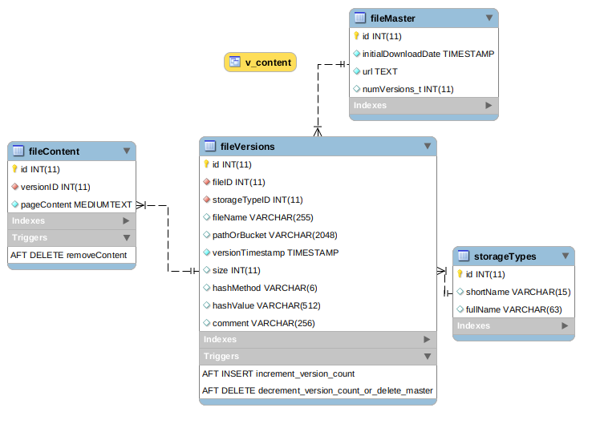
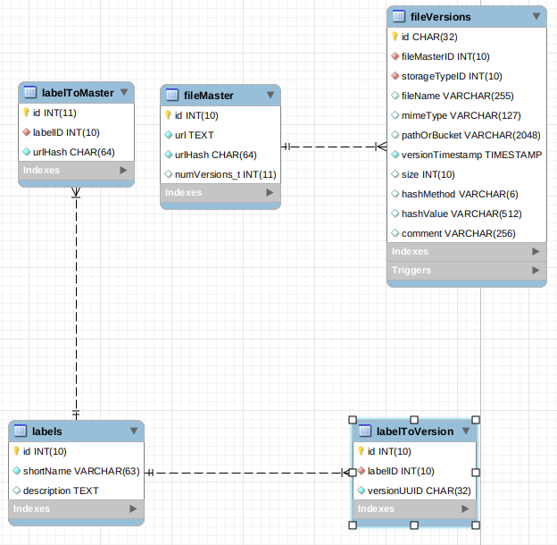

# Exoskeleton Database Structure

## The Queue

Exoskeleton works through the queue following the "first in - first out" principle. As soon an item has been downloaded, it is removed from the queue. In case of a temporary error (like a timeout) a crawling delay is added to the item and exoskeleton will try to download it later.

In case of a permanent error, the item stays in the queue, but gets marked. It is not deleted as sometimes servers do not signal a rate limit the right way, but answer for example with a "404 File Not Found" error instead.

## File and Data Management

Exoskeleton is able to handle multiple versions of the same file. A case for this might be keeping the original copy, but uploading a version with OCR applied to a Cloud.

* The `fileMaster` table is a comprehensive list of all files in the system.
* The `fileVersions` table contains information about different versions available and their location (`storageType`).
* If a file's content is stored in the database itself, it has an entry in `fileMaster`, another entry in `fileVersions` and its content in `fileContent`.

The relations between those tables are assured via foreign key constraints. On top there are database triggers: if the last version of a file is deleted, the corresponding entry is automatically removed from the `fileMaster` table.

## Labels

A central feature of exoskeleton is to add labels. The table `labels` manages those. Labels can be assigned to the entry in `fileMaster` or to specific versions of a file. Aptly named tables map these relationships.

## Stored Procedures

Exoskeleton uses several stored procedures in order to make complex changes to the database. Usually these are transactions to ensure referential integrity. You should not use these procedures directly. Instead call the corresponding python function which encapsulate them plus add logging, and error handling.
